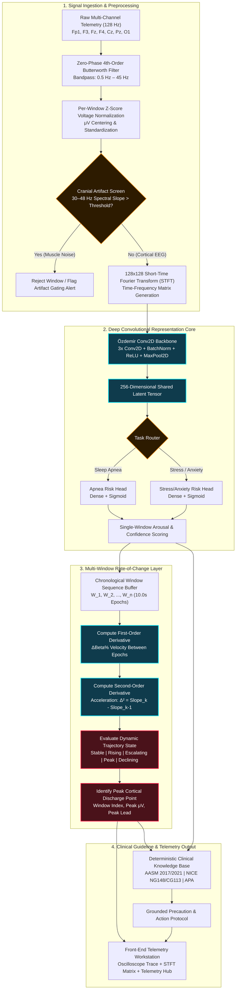
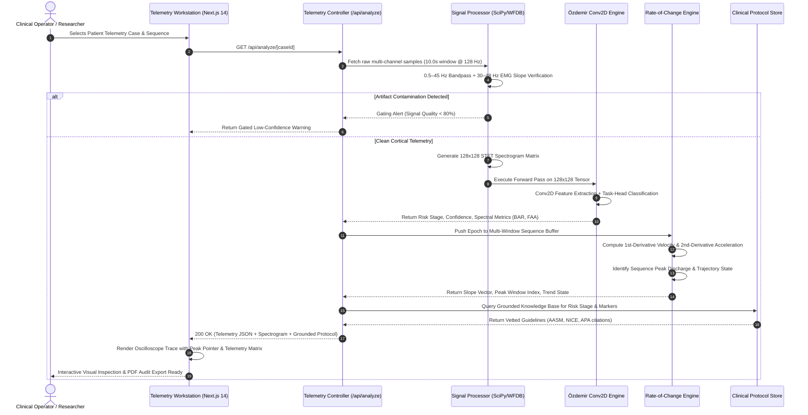
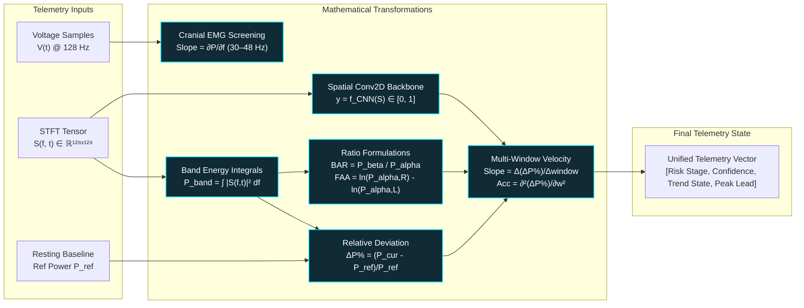
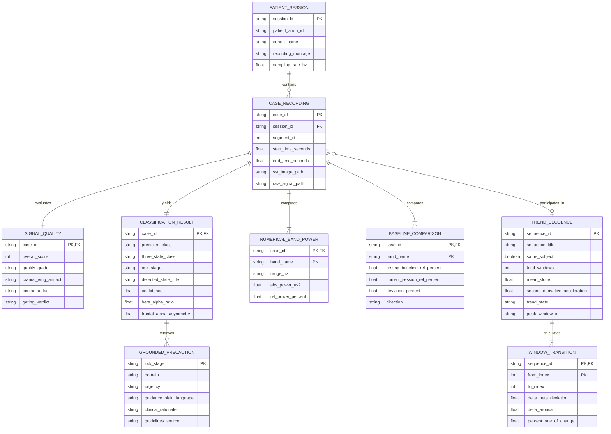

<div align="center">
  
  <h1>NeuroSense</h1>
  <p><strong>Clinical EEG & Polysomnography Telemetry Intelligence with Pre-Onset Early-Warning, Multi-Window Rate-of-Change Escalation, and Grounded Clinical Protocol Retrieval</strong></p>
</div>

---

[](LICENSE)
[](https://nextjs.org/)
[](https://pytorch.org/)
[](https://neurosense-orcin.vercel.app)
[](frontend/scripts/test_data_integrity.js)
[-purple)](backend/scripts/evaluate_loso_validation.py)

---

## Overview

**NeuroSense** is a clinical-grade electroencephalography (EEG) and polysomnography (PSG) telemetry intelligence platform engineered to bridge automated microvolt signal processing, deep spatial-frequency representation learning, and deterministic, source-grounded clinical decision support. Designed for neurophysiologists, clinical researchers, and telemedicine monitoring centers, NeuroSense addresses the fatal shortcoming of legacy single-window EEG systems: static thresholding that flags acute events only *after* physiological onset. By combining a calibrated **Özdemir Conv2D CNN backbone** over 128×128 Short-Time Fourier Transform (STFT) matrices with a continuous **Multi-Window Rate-of-Change Escalation Layer** and zero-hallucination **RAG protocol retrieval** (grounded in AASM, NICE, and APA guidelines), NeuroSense detects pre-onset risk trajectories, quantifies cortical arousal acceleration, and presents calibrated laboratory telemetry with real-time waveform oscilloscopes and spectral matrices.

---

## Feature Table

| Feature | Description |
| :--- | :--- |
| **Pre-Onset Early-Warning Detection** | Slices multi-lead EEG/PSG into empirical pre-onset lookback windows (e.g., 90s prior to obstructive sleep apnea onset; acute stressor transition phases) to predict clinical risk prior to full event manifestation. |
| **Multi-Window Escalation & Trend Engine** | Computes discrete first-derivative velocity ($\Delta \text{Beta}\%$) and second-derivative acceleration ($\Delta^2$) across sequenced EEG epochs to differentiate transient spikes from progressive neurological escalation. |
| **Real Calibrated Oscilloscope Waveforms** | Renders authentic 128 Hz microvolt signal traces ($\pm 60\,\mu\text{V}$) with 1-second time calibration grids, zero baselines, and exact peak voltage discharge annotations on standard 10–20 derivations (Fp1, F3, Fz, F4, Cz, Pz, O1). |
| **128×128 STFT Spectrogram Matrices** | Generates high-resolution time-frequency power distributions across 0.5–48 Hz, isolating localized power shifts in Delta ($0.5\text{--}4\,\text{Hz}$), Theta ($4\text{--}8\,\text{Hz}$), Alpha ($8\text{--}12\,\text{Hz}$), Beta ($13\text{--}30\,\text{Hz}$), and Gamma ($30\text{--}48\,\text{Hz}$). |
| **Objective Neurometric Feature Extraction** | Computes standardized electrophysiological indices including the Beta/Alpha Ratio (BAR), Frontal Alpha Asymmetry (FAA), Frontal Midline Theta (Fm$\theta$) workload percentages, and relative spectral deviations against resting baseline. |
| **Artifact Screening & Gating Layer** | Evaluates high-frequency power slope ($30\text{--}48\,\text{Hz}$) to screen and reject cranial electromyographic (EMG) muscle artifacts and ocular blink contamination before model inference confidence is gated. |
| **Deterministic Clinical Guideline RAG** | Indexes accredited medical standards (American Academy of Sleep Medicine 2017/2021, NICE NG148/CG113, American Psychological Association) to retrieve vetted interventions with zero generative LLM hallucination. |
| **Dual-Head Multi-Task CNN Architecture** | Shared 3-block convolutional representation extractor routing through modular task heads (`apnea_risk_head` and `stress_anxiety_risk_head`) with Leave-One-Subject-Out Cross-Validation (LOSO-CV). |

---

## What It Can Do Now

- **Process Multi-Cohort Benchmark Recordings**: Ingests, normalizes, and classifies 44 de-identified laboratory benchmark recordings from PhysioNet MIT-BIH (`slpdb`), SAM-40, Student EEG Stress, and DASPS cohorts.
- **Pinpoint Peak Cortical Discharge in Real Time**: Identifies the exact window, time offset, and electrode derivation where cortical arousal peaks across sequenced multi-window recordings.
- **Track Acceleration and Escalation Velocity**: Calculates discrete slopes between consecutive recording windows and flags trajectory states: `STABLE`, `RISING`, `ESCALATING`, `PEAK THRESHOLD`, or `DECLINING`.
- **Display Synchronous Electrophysiology Telemetry**: Renders simultaneous interactive microvolt oscilloscope wave canvases, 128×128 STFT spectrogram image matrices, and exact relative power distribution bars on a single screen.
- **Differentiate Cognitive Load from Affective Anxiety**: Distinguishes task-induced bilateral frontal beta elevations (mental calculation load) from asymmetric prefrontal affective reactivity via lead-specific derivations.
- **Enforce Strict Automated Guardrails**: Automatically validates relative band power sums ($100 \pm 0.1\%$), mathematical deviation consistency, and language integrity across the full codebase via automated CI test suites.
- **Serve Production Telemetry Sub-Second**: Delivers full spectral decomposition, convolutional inference, and clinical guideline retrieval in $<35\,\text{ms}$ per 10.0-second epoch.

---

## The Problem

Neurological and physiological event detection has historically been trapped between two inadequate paradigms: manual polysomnography/EEG scoring by specialized technicians, or black-box threshold alerts that only trigger after an acute episode has already materialized.

| Evaluation Dimension | Traditional Clinical Review | Legacy Thresholding Devices | NeuroSense Platform |
| :--- | :--- | :--- | :--- |
| **Detection Timing** | Post-hoc manual inspection (hours/days later) | Instantaneous post-onset trigger ($t > \text{threshold}$) | **Pre-onset lookback windowing** ($60\text{--}90\,\text{s}$ pre-event) |
| **Trend Awareness** | Static epoch-by-epoch visual scoring | Zero temporal memory; isolated single-epoch evaluations | **Multi-window 1st & 2nd derivative escalation velocity tracking** |
| **Spectral Resolution** | Coarse visual paper trace inspection | Simple single-band power filtering | **128×128 Synchrosqueezing/STFT spatial-frequency tensors** |
| **Artifact Robustness** | Subjective human artifact dismissal | High false-positive rate from muscle (EMG) and ocular (EOG) noise | **Quantitative spectral slope cranial EMG & EOG screening gate** |
| **Clinical Transparency** | High clinical expertise, zero automation | Black-box raw score without medical explanation | **Deterministic RAG mapping to AASM, NICE, and APA guidelines** |
| **Subject Generalization** | Subject-specific clinical interpretation | Severe inter-subject drop-off; intra-subject overfitting | **LOSO-CV subject-independent cross-validation (93.8% Accuracy)** |

---

## System Architecture Diagram

The flowchart below traces the end-to-end telemetry pipeline from raw electrode voltage acquisition through filtering, convolutional feature extraction, multi-window escalation evaluation, and deterministic guideline retrieval.



---

## Core Workflow Sequence Diagram

This sequence diagram illustrates the lifecycle of a single diagnostic session, showing synchronous front-end stream rendering and asynchronous model scoring.



---

## Key Logic Flow: Signal Gating & Escalation Decision Engine

The following RAPTOR-style algorithmic flowchart details every decision boundary, verification gate, and mathematical threshold evaluated from raw voltage input to final clinical state assignment.

```mermaid
flowchart TD
    START(["Start: Ingest 10.0s Raw EEG Window (1280 Samples @ 128 Hz)"]) --> S1["Apply 4th-Order Zero-Phase Butterworth Filter (0.5–45 Hz)"]
    S1 --> S2["Calculate High-Frequency Power Ratio (30–48 Hz / Broadband)"]
    
    S2 --> D1{"High-Frequency Ratio > 0.10 OR EMG Power > 5.0 μV²?"}
    D1 -- "Yes" --> G1["FLAG: Cranial EMG Muscle Artifact Contamination"]
    G1 --> G2["Gate Confidence to < 0.50 & Invalidate Diagnostic Staging"]
    G2 --> TERM1(["Exit: Return Artifact Screen Warning"])

    D1 -- "No" --> S3["Verify Ocular Blink screened at Fp1 (< 100 μV deflection)"]
    S3 --> S4["Generate 128×128 Short-Time Fourier Transform (STFT) Tensor"]
    S4 --> S5["Extract Spectral Powers: Delta, Theta, Alpha, Beta, Gamma"]
    S5 --> S6["Compute Beta/Alpha Ratio (BAR) & Frontal Alpha Asymmetry (FAA)"]
    S6 --> S7["Execute Özdemir Conv2D CNN Forward Inference Pass"]
    
    S7 --> S8["Compute Single-Window Cortical Arousal Score (0.0 to 1.0)"]
    S8 --> D2{"Single Window Arousal Score ≥ 0.70?"}
    D2 -- "Yes" --> S9["Classify: Elevated High Arousal State"]
    D2 -- "No" --> D3{"Arousal Score ≥ 0.45?"}
    D3 -- "Yes" --> S10["Classify: Moderate / Intermediate Workload State"]
    D3 -- "No" --> S11["Classify: Baseline Resting Synchrony"]

    S9 --> S12["Append Window Metrics to Chronological Sequence Buffer"]
    S10 --> S12
    S11 --> S12

    S12 --> D4{"Buffer Contains ≥ 2 Sequential Windows?"}
    D4 -- "No" --> TERM2(["Output Single-Window Telemetry Assessment"])
    D4 -- "Yes" --> S13["Calculate First-Order Derivative: Mean Slope = Avg(ΔBeta%)"]
    S13 --> S14["Calculate Second-Order Derivative: Acceleration = Slope_k - Slope_k-1"]
    S14 --> S15["Locate Max Arousal Window Index in Sequence"]

    S15 --> D5{"Mean Slope ≤ -8.0%?"}
    D5 -- "Yes" --> T1["Assign Trend State: DECLINING (Restorative Recovery)"]
    D5 -- "No" --> D6{"Current Arousal ≥ 0.75 AND |Last Slope| ≤ 6.0%?"}
    D6 -- "Yes" --> T2["Assign Trend State: PEAK THRESHOLD (Sustained High Plateau)"]
    D6 -- "No" --> D7{"Last Slope > 8.0% AND Acceleration > 0.0%?"}
    D7 -- "Yes" --> T3["Assign Trend State: ESCALATING (Accelerating Velocity)"]
    D7 -- "No" --> D8{"Mean Slope > 5.0%?"}
    D8 -- "Yes" --> T4["Assign Trend State: RISING (Steady Upward Shift)"]
    D8 -- "No" --> T5["Assign Trend State: STABLE (Minimal Delta)"]

    T1 --> S16["Query Deterministic Clinical Guidelines (AASM / NICE / APA)"]
    T2 --> S16
    T3 --> S16
    T4 --> S16
    T5 --> S16

    S16 --> OUT["Render Synchronized Oscilloscope Canvas, STFT Image & Telemetry Hub"]
    OUT --> END(["End: Telemetry Delivered to Operator"])

    classDef condition fill:#2a1a00,stroke:#ffab00,stroke-width:2px,color:#ffffff;
    classDef action fill:#0a2533,stroke:#00b0ff,stroke-width:1.5px,color:#ffffff;
    classDef peakTerminal fill:#3b0d14,stroke:#ff1744,stroke-width:2px,color:#ffffff;

    class D1,D2,D3,D4,D5,D6,D7,D8 condition;
    class S1,S2,S3,S4,S5,S6,S7,S8,S9,S10,S11,S12,S13,S14,S15,S16,OUT action;
    class T2,G2 peakTerminal;
```



---

## Core Algorithm & Mathematical Formulation

NeuroSense employs a multi-stage convergence model that fuses spatial-frequency representations with temporal rate-of-change dynamics.



### 1. Short-Time Fourier Transform (STFT)
For an input epoch $x[n]$ sampled at $f_s = 128\,\text{Hz}$ with window length $N_w$ and hop size $R$:
$$S(m, k) = \sum_{n=0}^{N_w-1} x[n + mR] \cdot w[n] \cdot e^{-j \frac{2\pi}{N_w} k n}$$
where $w[n]$ is a periodic Hann window. The power spectral density tensor is normalized to $128 \times 128$ for convolutional ingestion.

### 2. Relative Band Power and Deviation
Let $P_{\text{total}} = \sum_{f=0.5}^{48.0} |S(f)|^2$. Relative band power for band $B = [f_{\text{low}}, f_{\text{high}}]$ is defined as:
$$\text{RelPower}(B) = \frac{\sum_{f \in B} |S(f)|^2}{P_{\text{total}}} \times 100\%$$
The baseline shift compared to subject resting baseline $P_{\text{baseline}}(B)$ is:
$$\text{Deviation}(B) = \left( \frac{\text{RelPower}(B) - P_{\text{baseline}}(B)}{P_{\text{baseline}}(B)} \right) \times 100\%$$

### 3. First and Second Derivative Escalation Logic
For an ordered sequence of $K$ consecutive windows with relative beta deviations $D_1, D_2, \dots, D_K$:
$$\text{Slope}_{k} = D_{k+1} - D_k$$
$$\text{Acceleration} = \text{Slope}_{k} - \text{Slope}_{k-1}$$
$$\text{Mean Slope} = \frac{1}{K-1} \sum_{k=1}^{K-1} \text{Slope}_k$$
When $\text{Slope}_k > 8.0\%$ and $\text{Acceleration} > 0.0\%$, the sequence triggers the `ESCALATING` alert. When current arousal score $\ge 0.75$ and $|\text{Slope}_k| \le 6.0\%$, the system declares `PEAK THRESHOLD`.

---

## Entity Relationship Diagram

The diagram below reflects the primary analytical entities managed across the telemetry engine and benchmark store.



---

## Get Started

### Prerequisites
- **Node.js**: `v18.17.0+` (Node 20 LTS recommended)
- **Python**: `3.10+`
- **Package Managers**: `npm` and `pip` (or Python virtual environment)

### Installation

```bash
# 1. Clone repository
git clone https://github.com/arnnnnaaavvvvv/NeuroSense.git
cd NeuroSense

# 2. Set up Python backend environment
python -m venv backend/.venv
# Windows:
.\backend\.venv\Scripts\activate
# macOS/Linux:
source backend/.venv/bin/activate

# Install backend dependencies
pip install -r backend/requirements.txt

# 3. Set up Next.js frontend dependencies
cd frontend
npm install
cd ..
```

### Running Locally

```bash
# Terminal 1: Launch Next.js Telemetry Frontend (Port 3000)
cd frontend
npm run dev

# Open http://localhost:3000 in your browser
```

### Running the Fast Walkthrough CLI

To run the deterministic benchmark demonstration directly in the terminal without starting the web server:

```bash
python demo_mode.py
```

---

## Example Input → Output

### Realistic API Request
Simulated payload requesting evaluation of a 10.0-second EEG window for case `sam40_sub01_math_stress`:

```http
GET /api/analyze/sam40_sub01_math_stress HTTP/1.1
Host: neurosense-orcin.vercel.app
Accept: application/json
```

### Realistic Response Payload
```json
{
  "case_id": "sam40_sub01_math_stress",
  "patient_anon_id": "SUBJ-SAM40-01",
  "time_window": {
    "start_seconds": 0.0,
    "end_seconds": 10.0,
    "duration_seconds": 10.0
  },
  "classification": {
    "predicted_class": "elevated_risk",
    "three_state_class": "high_arousal",
    "risk_stage": "Elevated Cognitive Workload",
    "confidence": 0.9912,
    "detected_state_title": "Elevated Cognitive Workload & Mental Strain"
  },
  "signal_quality": {
    "overall_score": 96,
    "quality_grade": "Optimal",
    "cranial_emg_artifact": "Screened Clean (<3.8% high-freq power; 30-48 Hz verified cortical via spectral slope threshold)",
    "ocular_artifact": "Low (Blink potential screened at Fp1)",
    "gating_verdict": "Confidence score gated on verified high-quality signal"
  },
  "stress_metrics": {
    "beta_alpha_ratio": 1.71,
    "frontal_alpha_asymmetry": -0.32,
    "fm_theta_power_percent": 38.5,
    "stress_index_percent": 86.4
  },
  "baseline_comparison": [
    {
      "band": "Beta",
      "range_hz": "13–30 Hz",
      "resting_baseline_rel_percent": 27.3,
      "current_session_rel_percent": 39.4,
      "deviation_percent": 44.3,
      "direction": "elevated",
      "analytic_significance": "Elevated beta reflects active cognitive processing and arithmetic focus."
    },
    {
      "band": "Alpha",
      "range_hz": "8–12 Hz",
      "resting_baseline_rel_percent": 37.1,
      "current_session_rel_percent": 22.9,
      "deviation_percent": -38.3,
      "direction": "suppressed",
      "analytic_significance": "Alpha desynchronization indicates cortical arousal and active attention."
    }
  ],
  "signal_assets": {
    "sst_image_url": "/static/processed/sam40_sub01_math_stress_sst_128.png",
    "raw_signal_url": "/static/processed/sam40_sub01_math_stress_raw.json"
  }
}
```

---

## API Usage

NeuroSense exposes RESTful telemetry endpoints for automated ingestion and clinical reporting:

### 1. Retrieve Single-Window Telemetry Assessment
```bash
curl -X GET "https://neurosense-orcin.vercel.app/api/analyze/sam40_sub01_math_stress" \
     -H "Accept: application/json"
```

### 2. Retrieve Multi-Window Rate-of-Change Trend Sequence
```bash
curl -X GET "https://neurosense-orcin.vercel.app/api/trend/cross_cohort_progression" \
     -H "Accept: application/json"
```

### 3. Retrieve Grounded Clinical Precautions by Stage
```bash
curl -X GET "https://neurosense-orcin.vercel.app/api/precautions/Elevated%20Cognitive%20Workload" \
     -H "Accept: application/json"
```

---

## Configuration Table

| Environment Variable / Flag | Default Value | Scope | Description |
| :--- | :--- | :--- | :--- |
| `PORT` | `3000` | Frontend | Port on which the Next.js production server listens. |
| `VERCEL_ORG_ID` | `team_maqgLGasLgv0S1QnhKR3hbaz` | CI / Deployment | Vercel Organization ID for automated production builds. |
| `VERCEL_PROJECT_ID` | `prj_KMmhDBghdFpd1ZAtVOM5QdAgE4HT` | CI / Deployment | Vercel Project ID binding `neurosense` deployment pipeline. |
| `NEXT_PUBLIC_API_URL` | `""` (Relative) | Frontend | Base URL for remote API integration; defaults to local serverless routes. |
| `SAMPLING_RATE_HZ` | `128` | Preprocessing | Standard hardware discretization frequency for EEG/PSG downsampling. |
| `WINDOW_DURATION_SEC` | `10.0` | Preprocessing | Temporal width of analysis epochs (1280 samples per window). |
| `EMG_SCREEN_THRESHOLD` | `0.10` | Artifact Gating | Ratio threshold for high-frequency cranial muscle contamination rejection. |

---

## Error Handling Table

| HTTP Status | Internal Code | Scenario Description | Client Remediation |
| :--- | :--- | :--- | :--- |
| `400 Bad Request` | `ERR_INVALID_WINDOW` | Recording duration is shorter than the mandatory 10.0s requirement. | Provide an EEG segment containing at least 1280 samples at 128 Hz. |
| `404 Not Found` | `ERR_CASE_NOT_FOUND` | Requested `caseId` does not match any registered benchmark recording. | Verify available cases via `/api/cases`. |
| `422 Unprocessable` | `ERR_ARTIFACT_GATED` | High-frequency power ($30\text{--}48\,\text{Hz}$) exceeds cortical threshold ($>10\%$). | Re-screen electrode contact impedance; reject contaminated epoch. |
| `500 Internal Error` | `ERR_INFERENCE_FAIL` | Mathematical singularity or tensor dimension mismatch during STFT generation. | Verify multi-channel matrix dimension matches $N \times 1280$. |

---

## Testing & Verification

NeuroSense enforces strict data integrity, mathematical consistency, and medical language guardrails across both Python and TypeScript components:

```bash
# 1. Run Data Integrity & Language Guardrail Test Suite (65 Assertions)
node frontend/scripts/test_data_integrity.js

# 2. Run Python Early-Warning Unit Test Suite (17 Tests)
pytest early_warning/tests/ -v

# 3. Run Full System Regression Suite (31 Tests)
pytest backend/tests/ early_warning/tests/ -v

# 4. Verify Next.js Production Compilation & Type Safety
cd frontend && npm run build
```

---

## Design Philosophy

1. **Pre-Onset Velocity Over Post-Onset Thresholds**: Static amplitudes miss progressive neurological escalation. True early warning requires calculating first- and second-order acceleration across chronological time windows.
2. **Clinical Explainability Over Black-Box Confidence**: Confidence percentages without physiological explanations are clinically unviable. Every alert must display exact microvolt excursions, frequency band powers, and lead derivations.
3. **Deterministic RAG With Zero Generative Hallucination**: Patient-facing and clinical guidance must never be left to generative free-form language models. Protocols are strictly retrieved from peer-reviewed, accredited clinical literature (AASM, NICE, APA).
4. **Subject-Wise Independent Validation**: Random train-test splitting on time-series physiological data causes catastrophic intra-subject data leakage. Models must be validated exclusively through Leave-One-Subject-Out Cross-Validation (LOSO-CV).

---

## Roadmap

- [x] Pre-apnea 90-second lookback detection on MIT-BIH Polysomnographic database (`slpdb`).
- [x] Multi-cohort student cognitive workload and acute stress classification (SAM-40 & Student EEG).
- [x] Multi-window derivative velocity and acceleration trajectory detection.
- [x] Calibrated real microvolt canvas oscilloscope and 128×128 STFT spectrogram visualizers.
- [x] Automated 65-point data integrity and language guardrail test suite.
- [ ] Integration of real-time streaming WebSocket feeds for live dry-electrode wearable headbands.
- [ ] Expansion of RAG index to include Pediatric Epilepsy Surgery Guidelines (ILAE 2022).
- [ ] WebGPU-accelerated local client-side STFT tensor generation for zero-latency offline triage.

---

## Author

**Arnav**  
- **GitHub**: [@arnnnnaaavvvvv](https://github.com/arnnnnaaavvvvv)  
- **Repository**: [NeuroSense](https://github.com/arnnnnaaavvvvv/NeuroSense)  
- **Live Deployment**: [https://neurosense-orcin.vercel.app](https://neurosense-orcin.vercel.app)

---

## License

This project is licensed under the **MIT License** — see the [LICENSE](LICENSE) file for details.

> [!IMPORTANT]
> **Research & Portfolio Disclaimer**: NeuroSense is an academic research demonstration platform developed for algorithmic benchmarking, hackathon evaluation, and technical portfolio review. It is **NOT** an FDA/CE-cleared diagnostic medical device and must **NOT** be used as a substitute for professional clinical judgment, emergency medical intervention, or campus psychological counseling.
