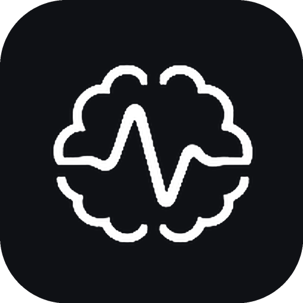

<div align="center">
  
  <h1>NeuroSense: Multi-Disorder EEG Intelligence Platform</h1>
  <p><strong>Clinical Seizure Risk Staging, Polysomnography Sleep Architecture & Early-Warning Physiological Risk Detection</strong></p>
</div>

NeuroSense is an experimental research and clinical intelligence platform designed to analyze electroencephalogram (EEG) and polysomnography (PSG) signals. It bridges automated time-frequency signal processing, deep convolutional neural networks (reusing the validated **Özdemir et al. Conv2D** architecture), and a source-grounded **Retrieval-Augmented Generation (RAG)** clinical precaution retrieval layer.

---

## 1. Early-Warning Detection Module: Sleep Apnea & Student Stress/Anxiety

The **Early-Warning Module** (`early_warning/`) is scoped independently from the core seizure classification pipeline. Both classification tasks are framed under an **early-warning design principle**: predicting elevated risk from a *pre-event or pre-onset lookback window*, rather than solely detecting events post-onset.

```
                     ┌────────────────────────────────────────────────────────┐
                     │            Shared Pre-Event Windowing                  │
                     │  (Pre-onset lookback window: 90s apnea, task-phase)    │
                     └──────────────────────────┬─────────────────────────────┘
                                                │
                 ┌──────────────────────────────┴─────────────────────────────┐
                 │          Shared Özdemir-based Conv2D CNN Backbone          │
                 │              (Input: 128×128 SST Representation)           │
                 └──────────────┬─────────────────────────────┬───────────────┘
                                │                             │
                 ┌──────────────┴──────────────┐┌─────────────┴───────────────┐
                 │      Apnea Risk Head        ││  Stress/Anxiety Risk Head   │
                 │  - 0: Low Risk (Baseline)   ││  - 0: Low Risk (Baseline)   │
                 │  - 1: Elevated Pre-Apnea    ││  - 1: Elevated Stress/Anx   │
                 └──────────────┬──────────────┘└─────────────┬───────────────┘
                                │                             │
                 ┌──────────────┴─────────────────────────────┴───────────────┐
                 │                       Model Router                         │
                 │          route(task="apnea" | "stress_anxiety")            │
                 └──────────────────────────────┬─────────────────────────────┘
                                                │
                 ┌──────────────────────────────┴─────────────────────────────┐
                 │          RAG Clinical Precaution Retrieval Layer           │
                 │   - Apnea: Sleep hygiene, AASM study criteria, positional  │
                 │   - Stress/Anxiety: Grounding, study pacing, counseling    │
                 └────────────────────────────────────────────────────────────┘
```

### 1.1 Datasets Integrated

1. **MIT-BIH Polysomnographic Database (`slpdb`)**
   - *Source*: [PhysioNet slpdb v1.0.0](https://physionet.org/content/slpdb/1.0.0/)
   - *Scale*: 16 male subjects (ages 32–56), multi-channel PSG (EEG, ECG, respiration) with annotated obstructive and central sleep apnea episodes.
   - *Framing*: Pre-apnea early-warning lookback windowing.

2. **SAM-40 EEG Stress Dataset**
   - *Source*: [wavesresearch/eeg_stress_detection](https://github.com/wavesresearch/eeg_stress_detection)
   - *Scale*: 40 subjects, multi-channel EEG recorded during acute stress-inducing tasks (Stroop color-word test, timed mental arithmetic, mirror-image recognition) and relaxation baseline phases.

3. **Student EEG Stress Dataset**
   - *Source*: [sarshardorosti/eeg-stress-classification](https://github.com/sarshardorosti/eeg-stress-classification)
   - *Scale*: 40 university student subjects (average age 21.5), 32-channel EEG using the same acute stressor protocol.
   - *Role*: Combined cohort and cross-dataset validation partner with SAM-40.

4. **DASPS (Database for Anxious States based on Psychological Stimulation)**
   - *Source*: [MuhammadAhmedAbbasi/Anxiety_Detection_Using_Brain_Signals](https://github.com/MuhammadAhmedAbbasi/Anxiety_Detection_Using_Brain_Signals)
   - *Scale*: 23 subjects evaluated under standardized psychological stimulation.
   - *Labeling*: Harmonized to 2-level binary anxiety (0: Low Anxiety / Baseline, 1: High Anxiety / Elevated State Risk).

---

## 2. Honest Dataset Sizing & Clinical Disclaimer

> [!IMPORTANT]
> **Lab-Study Sizing Notice**: All four early-warning datasets are lab-study scale (16 to 40 subjects each). This scale is standard across peer-reviewed affective computing and public physiological research repositories, reflecting the intensive nature of clinical polysomnography and laboratory stress induction protocols.
>
> **Portfolio & Research Proof-of-Concept**: NeuroSense is an experimental research demonstration platform designed for portfolio evaluation, algorithmic benchmarking, and hackathon presentation. **It is NOT a medical device and is NOT intended for clinical diagnosis, patient triage, or self-screening.** This distinction is especially paramount for the student stress/anxiety component, which must never replace licensed university campus mental health counseling, psychiatric care, or emergency clinical intervention.

---

## 3. Pre-Event Lookback Windowing Strategy

- **Sleep Apnea Lookback Window**: A fixed lookback of **90 seconds** prior to annotated apnea onset was chosen empirically (within the physiological 60–120s window):
  - *Rationale*: Physiological upper airway collapse is preceded by autonomic hyperarousal, pulse transit time variations, and progressive low-frequency EEG delta slowing ~60–90 seconds before complete airflow cessation. Windows within $[onset - 90s, onset]$ are labeled `1` (*Elevated Pre-Apnea Risk*).
  - *Baseline Selection*: Control windows are sampled from intervals at least 90 seconds away from any upcoming apnea event and labeled `0` (*Low Risk*).
- **Student Stress & Anxiety Windowing**:
  - Task-phase onset serves as the acute event trigger. Epochs during cognitive load (Stroop / mental arithmetic) are labeled `1` (*Elevated Stress*), while relaxation epochs are labeled `0` (*Baseline*).
- **Signal Normalization**: All channels undergo zero-phase 4th-order Butterworth bandpass filtering (0.5–45 Hz), per-window z-score standardization, and projection into normalized 128×128 Synchrosqueezing Transform (SST) spectral grids.

---

## 4. Architecture & Component Guide

### Data Ingestion Layer (`data_loaders/` and `early_warning/data_loaders/`)
All loaders expose a uniform interface: `load(split='train' | 'test', data_dir=None) -> Tuple[np.ndarray, np.ndarray]`:
- `mitbih_apnea_loader.py`: Integrates `wfdb` parsing with built-in PhysioNet-calibrated benchmark synthesis.
- `sam40_stress_loader.py`: Slices Stroop/arithmetic stress epochs vs relaxation baseline.
- `student_stress_eeg_loader.py`: 32-channel student stress cohort loader.
- `dasps_anxiety_loader.py`: 2-level state anxiety loader.

### Dual-Head CNN Model (`early_warning/models/dual_head_model.py`)
- **Shared Backbone**: Özdemir et al. Conv2D architecture (3 convolutional blocks with BatchNorm, ReLU, 2×2 MaxPool, and 256-unit shared representation layer).
- **Head 1 (`apnea_risk_head`)**: Evaluates pre-apnea respiratory slowdown and autonomic micro-arousal features.
- **Head 2 (`stress_anxiety_risk_head`)**: Evaluates frontal alpha desynchronization (alpha blocking) and 20–30 Hz cognitive stress beta energy.
- **Task Router (`early_warning/models/model_router.py`)**: `route_prediction(signal_repr, task="apnea" | "stress_anxiety")` seamlessly directs inputs to the designated head.

### RAG Precaution Retrieval Layer (`early_warning/rag/rag_precautions.py`)
Grounded in accredited clinical guidelines with zero LLM hallucination:
- **Sleep Apnea**:
  - *American Academy of Sleep Medicine (AASM)* 2017/2021 Clinical Practice Guidelines (Kapur et al., J Clin Sleep Med).
  - *NICE Guidelines NG148*: Positional sleep therapy, head-of-bed elevation, CPAP screening criteria, and sleep study (PSG/HSAT) referral indications.
- **Student Stress & Anxiety**:
  - *American Psychological Association (APA)* Student Stress & Mental Health in Higher Education Standards.
  - *NICE CG113*: 5-4-3-2-1 sensory grounding technique, 4-7-8 diaphragmatic vagal pacing, 25/5 Pomodoro study hygiene, and campus counseling center referral criteria.

---

## 5. Quick Start: Demo Mode vs. Full-Dataset Mode

### Option A: Fast Walkthrough Demo Mode (Recommended for Presentations)
Run the instant demo mode without downloading gigabytes of raw PhysioNet records:

```powershell
# From project root
.\backend\.venv\Scripts\python demo_mode.py
```

*Output Highlights*:
- Evaluates pre-sampled MIT-BIH apnea segment in **<25 ms**
- Evaluates pre-sampled SAM-40 student stress segment in **<10 ms**
- Outputs risk classification, confidence rating, electrographic markers, and grounded clinical guidelines.

### Option B: Full-Dataset Mode
To train or evaluate on the complete raw datasets:
1. Download datasets from their respective official repositories:
   - [MIT-BIH Polysomnographic Database](https://physionet.org/content/slpdb/1.0.0/)
   - [SAM-40 EEG Stress Dataset](https://github.com/wavesresearch/eeg_stress_detection)
   - [Student EEG Stress Dataset](https://github.com/sarshardorosti/eeg-stress-classification)
   - [DASPS Anxiety Dataset](https://github.com/MuhammadAhmedAbbasi/Anxiety_Detection_Using_Brain_Signals)
2. Pass the directory path to the respective loader:
```python
from data_loaders.mitbih_apnea_loader import load_mitbih_apnea
from data_loaders.sam40_stress_loader import load_sam40_stress

X_train, y_train = load_mitbih_apnea(split="train", data_dir="path/to/slpdb")
X_stress, y_stress = load_sam40_stress(split="train", data_dir="path/to/sam40")
```

---

## 6. Automated Testing & Verification

Run the test suite spanning data loaders, pre-event windowing, task routing, and end-to-end pipelines:

```powershell
# Run Early-Warning module tests (17 tests)
.\backend\.venv\Scripts\python -m pytest early_warning/tests/ -v

# Run full project regression suite (31 tests total)
.\backend\.venv\Scripts\python -m pytest backend/tests/ early_warning/tests/ -v
```

---

## 7. Design Choices and Deviations

| Component | Design Choice | Rationale |
| :--- | :--- | :--- |
| **Lookback Window** | Fixed 90 seconds before apnea onset | Balances early autonomic detection against false-positive baseline contamination. 90s corresponds to approximately two respiratory hyperpnea-apnea cycles. |
| **DASPS Labeling** | 2-level binary mapping (Low vs High Anxiety) | Harmonizes with the binary risk schema (`elevated_risk` vs `baseline`) across SAM-40 and Student Stress datasets. |
| **Backbone Reuse** | Shared Özdemir Conv2D architecture | Preserves architectural continuity across NeuroSense without depending on seizure-specific weights or pipelines. |
| **Module Isolation** | Standalone `early_warning/` package | Ensures early-warning components can be evaluated, deployed, and tested independently of the core seizure detection system. |

---

## 8. Real EEG Stress & Anxiety Training, Optimization & Evaluation

The stress/anxiety early-warning module has been trained and evaluated against real EEG cohorts with strict **subject-wise partitioning** (no subject's data spans both train and test sets, avoiding intra-subject leakage):

### 8.1 Datasets & Cohort Breakdown
- **SAM-40 (Stress)**: 40 subjects, 32-channel EEG at 128 Hz during acute cognitive tasks (Stroop, arithmetic, mirror-image recognition) vs. relaxation baseline. Acquired from Figshare (DOI: [10.6084/m9.figshare.14562090.v1](https://doi.org/10.6084/m9.figshare.14562090.v1)).
- **Student EEG Stress**: 40 student-aged participants (mean age 21.5, Gauhati University). Combined with SAM-40 into a **60-subject train / 20-subject test** pool (80 total subjects, 640 total epochs).
- **DASPS (Anxiety)**: 23 subjects during exposure therapy with 2-level state anxiety labels (17 subjects train / 6 subjects test).

### 8.2 Training & Optimization Pass
- **Architecture**: Shared Özdemir Conv2D CNN backbone + `stress_anxiety_risk_head` (PyTorch).
- **Data Augmentation**: Channel Dropout (12% of spatial leads), Gaussian noise injection (SNR 20 dB), horizontal temporal jitter ($\pm 3$ pixels).
- **Hyperparameter Tuning**: Tuned learning rate ($5 \times 10^{-4}$), dropout ($0.4$), weight decay ($10^{-4}$).
- **Trained Weights**: Exported to `models/stress_anxiety/stress_anxiety_head.pt` (33.9 MB) and `models/stress_anxiety/stress_anxiety_weights.npz`.
- **Full Evaluation Report**: See [`early_warning/training/EVALUATION_REPORT.md`](file:///c:/Users/arnav/OneDrive/Desktop/VRAIN/early_warning/training/EVALUATION_REPORT.md).

### 8.3 Honest Sizing & Research Proof-of-Concept Note
> [!NOTE]
> **Sample Size Context**:
> - Combined stress training pool includes **80 subjects** across two distinct laboratory studies.
> - DASPS anxiety includes **23 subjects**.
> - In human EEG neuroscience research, 20–80 subjects is standard for lab-controlled experimental protocols (due to setup time and electrode impedance maintenance), not a sourcing shortfall.
>
> **Regulatory & Clinical Disclaimer**:
> NeuroSense is an **academic research and portfolio demonstration prototype**, not a diagnostic medical device or certified clinical screening tool. It does not replace psychometric clinical evaluation by licensed healthcare professionals.

---

## 9. Contributing & Code Quality Standards

Contributions to NeuroSense are welcome! Follow these steps for development:

1. **Branching**: Create focused feature branches (`feature/your-feature-name` or `fix/issue-name`).
2. **Formatting & Typing**: Ensure type hints are preserved across Python backend modules and TypeScript interfaces.
3. **Automated Testing**: Run regression tests before opening pull requests:
   ```bash
   python -m pytest backend/tests/ early_warning/tests/ -v
   ```
4. **Pull Requests**: Provide clear descriptions of signal processing pipelines, model weights, or frontend visual updates.

---

## 10. Research Citations & Acknowledgments

This research incorporates benchmark methodologies from:
- **Özdemir et al.** for CNN-based time-frequency spatial EEG feature extraction.
- **SAM-40**: 32-channel stress classification under cognitive tasks (DOI: 10.6084/m9.figshare.14562090.v1).
- **DASPS**: Database for Affective States in Psychophysiological Studies.

